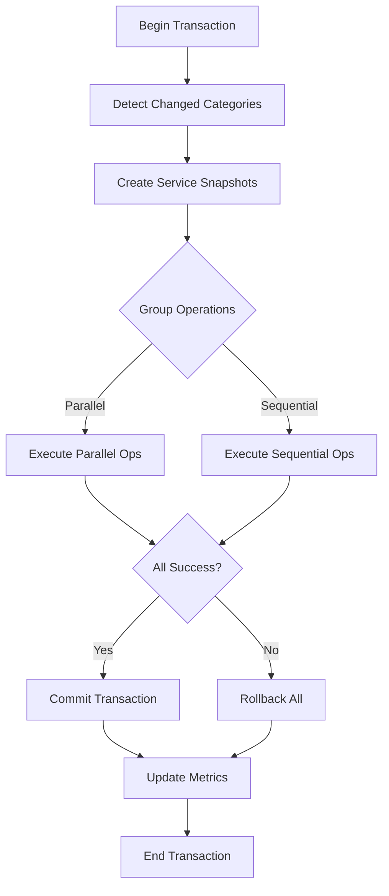

# Atomic Application System - Architecture Documentation

## Overview

The Atomic Application System provides transactional settings updates with complete rollback capability for the Python desktop application. It ensures system stability by applying configuration changes atomically - either all changes succeed or none are applied.

## Core Components

### 1. TransactionalSettingsApplier
**Location**: `app/config/atomic_applier.py`

The main orchestrator that manages atomic updates across all services:
- Coordinates service updates in dependency order
- Manages parallel and sequential operations
- Tracks performance metrics
- Handles rollback on failures

```python
applier = TransactionalSettingsApplier(max_parallel_workers=3)
applier.register_service('webcam', webcam_service)
success = applier.apply_settings(config, changed_categories={'camera'})
```

### 2. TransactionManager
**Location**: `app/config/atomic_applier.py`

Manages individual transactions with all-or-nothing semantics:
- Maintains transaction state
- Executes operations in order
- Performs automatic rollback on failure
- Manages service snapshots

### 3. ServiceDependencyGraph
**Location**: `app/config/atomic_applier.py`

Manages service dependencies and determines safe update order:
- Topological sorting of services
- Circular dependency detection
- Priority-based ordering

Default dependency hierarchy:
```
webcam (CRITICAL)
  ├── detection (HIGH)
  │   ├── gemini (MEDIUM)
  │   ├── inference (MEDIUM)
  │   └── training (LOW)
  └── ui (LOW)
```

### 4. Enhanced SettingsManager
**Location**: `app/config/settings_manager.py`

Integrates atomic updates into the settings management workflow:
- Detects changed setting categories
- Validates configurations before applying
- Creates backups for rollback
- Manages service registration

## Update Types

### HOT_RELOAD
- Applied without service interruption
- Examples: Detection thresholds, AI parameters
- Duration: <100ms

### RESTART
- Requires service stop/start
- Examples: Camera resolution, FPS changes
- Duration: 100-500ms

### RECREATE
- Service must be completely recreated
- Examples: Major model changes
- Duration: 500ms+

### IMMEDIATE
- Applied directly without validation
- Examples: UI theme, debug flags
- Duration: <50ms

## Service Priorities

1. **CRITICAL**: Core services that others depend on (webcam)
2. **HIGH**: Important services with dependencies (detection)
3. **MEDIUM**: Standard services (gemini, inference)
4. **LOW**: Optional services (ui, training)

## Setting Categories

### Camera Settings (HIGH Priority)
- Webcam device selection
- Resolution and FPS
- Camera controls (brightness, contrast, saturation)
- Auto exposure/focus settings
- **Update Type**: RESTART

### Detection Settings (MEDIUM Priority)
- Confidence thresholds
- IoU thresholds
- ROI configuration
- Model selection
- **Update Type**: HOT_RELOAD

### AI Settings (MEDIUM Priority)
- API keys and endpoints
- Model parameters (temperature, tokens)
- Rate limiting
- Context window
- **Update Type**: HOT_RELOAD

### UI Settings (LOW Priority)
- Theme selection
- Window state
- Language preferences
- **Update Type**: IMMEDIATE

## Transaction Flow



## Performance Optimization

### Parallel Execution
Operations without dependencies execute simultaneously:
- Multiple UI updates
- Independent service configurations
- Threshold adjustments

### Smart Updates
Only affected services are updated based on changed categories:
- Reduces unnecessary operations
- Minimizes service downtime
- Improves response time

### Metrics Tracking
```python
PerformanceMetrics:
  - total_duration_ms: Total time for update
  - service_durations: Time per service
  - parallel_operations: Count of parallel ops
  - sequential_operations: Count of sequential ops
  - rollbacks_performed: Number of rollbacks
  - operations_executed: Successful operations
```

## Error Recovery

### Automatic Rollback
On any failure:
1. Stop remaining operations
2. Rollback executed operations (reverse order)
3. Restore service snapshots
4. Log failure details
5. Notify user

### State Snapshots
Each service can provide state snapshots:
```python
def create_snapshot(self) -> Dict[str, Any]:
    return {
        'config': self.config,
        'state': self.current_state,
        'is_running': self.is_running
    }

def restore_snapshot(self, snapshot: Dict[str, Any]):
    self.config = snapshot['config']
    self.current_state = snapshot['state']
    self.is_running = snapshot['is_running']
```

## Usage Examples

### Basic Atomic Update
```python
settings_manager = SettingsManager()
config = settings_manager.config
config.camera_width = 1920
config.camera_height = 1080

# Apply atomically
success = settings_manager.save_settings(config, use_atomic=True)
```

### Context Manager
```python
with settings_manager.atomic_update() as config:
    config.detection_confidence_threshold = 0.7
    config.gemini_temperature = 0.8
    # Automatically saved and applied on exit
```

### Partial Update
```python
# Only update detection settings
changed_categories = {'detection'}
success = settings_manager.apply_settings(config, use_atomic=True)
```

## Performance Requirements

- **Complete atomic update**: <2 seconds
- **Service downtime**: <100ms per service
- **Parallel operations**: Where dependencies allow
- **Rollback time**: <500ms total

## Best Practices

1. **Register all services** before applying settings
2. **Use atomic updates** for production changes
3. **Monitor performance metrics** for optimization
4. **Implement snapshots** for stateful services
5. **Test rollback scenarios** thoroughly
6. **Log all operations** for debugging

## Configuration

### Enable/Disable Atomic Updates
```python
# Use atomic transactions (recommended)
settings_manager.save_settings(config, use_atomic=True)

# Use traditional updates (backward compatibility)
settings_manager.save_settings(config, use_atomic=False)
```

### Customize Thread Pool
```python
applier = TransactionalSettingsApplier(max_parallel_workers=5)
```

### Set Operation Timeouts
```python
operation = AtomicOperation(
    service_name="webcam",
    timeout_seconds=10.0  # Custom timeout
)
```

## Testing

Run the test suite to validate the system:
```bash
python test_atomic_settings.py
```

Tests cover:
- Successful atomic updates
- Rollback on failure
- Partial updates
- Context manager usage
- Performance metrics
- Service dependencies

## Monitoring

Access performance history:
```python
applier = settings_manager._transactional_applier
for entry in applier.performance_history:
    print(f"{entry['timestamp']}: {entry['metrics'].get_summary()}")
```

## Future Enhancements

1. **Distributed transactions** for multi-process services
2. **Persistent transaction log** for recovery
3. **Async operation support** for I/O-bound updates
4. **Configuration validation rules** engine
5. **Automatic retry** with exponential backoff
6. **Health checks** before and after updates