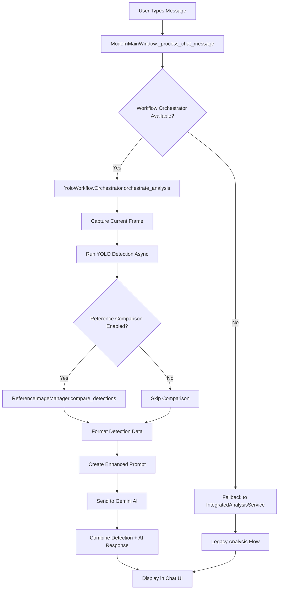

# YOLO Workflow Orchestration Architecture

## Overview

This document describes the integrated YOLO analysis workflow architecture that has been implemented for automatic object detection and AI-powered chat analysis in the Webcam Master Checker application.

## Architecture Components

### 1. Core Services

#### YoloWorkflowOrchestrator (`app/services/yolo_workflow_orchestrator.py`)
- **Purpose**: Coordinates the entire YOLO analysis workflow
- **Key Features**:
  - Async/await patterns for non-blocking operations
  - Thread pool execution for CPU-intensive tasks
  - Performance monitoring integration
  - Result caching for improved response times
  - Graceful error handling with fallback mechanisms

#### ReferenceImageManager (`app/services/reference_manager.py`)
- **Purpose**: High-performance reference image management
- **Performance Targets**:
  - Reference capture: <200ms including YOLO analysis
  - Object comparison: <100ms for typical scenes (5-10 objects)
  - Memory footprint: <50MB baseline + ~1MB per reference
  - Cache hit rate: >80% for repeated comparisons

#### DetectionDataFormatter (`app/utils/detection_formatter.py`)
- **Purpose**: Formats YOLO detection data into user-friendly display
- **Features**:
  - Object coordinates and bounding boxes
  - Confidence scores and class names
  - Scene comparison summaries
  - Angle and position calculations

### 2. Integration Flow



### 3. Configuration Schema

```json
{
  "auto_yolo_analysis": true,              // Enable automatic YOLO on chat messages
  "reference_comparison_enabled": true,     // Enable reference image comparison
  "min_detection_confidence": 0.5,         // Minimum confidence for detections
  "max_objects_to_analyze": 10,            // Max objects to include in analysis
  "workflow_async_timeout": 5.0,           // Async operation timeout (seconds)
  "workflow_performance_monitoring": true,  // Enable performance tracking
  "cache_analysis_results": true,          // Cache results for reuse
  "max_references": 100,                   // Max stored reference images
  "reference_max_memory_mb": 50,           // Max memory for references
  "reference_compression": true            // Enable image compression
}
```

### 4. API Endpoints

#### Workflow Orchestrator API

```python
async def orchestrate_analysis(
    current_frame: np.ndarray,
    user_message: str,
    reference_frame: Optional[np.ndarray] = None
) -> WorkflowResult
```

**Returns**: `WorkflowResult` containing:
- `detections`: List of detected objects
- `comparison_result`: Reference comparison data
- `formatted_data`: Human-readable detection summary
- `enhanced_prompt`: Prompt sent to AI
- `ai_response`: Gemini AI response
- `workflow_time_ms`: Total execution time
- `performance_metrics`: Detailed timing breakdown

#### Reference Manager API

```python
def capture_reference(
    image: np.ndarray,
    confidence_threshold: float = 0.5
) -> str  # Returns reference_id

def compare_detections(
    current_detections: List[Detection],
    reference_id: str
) -> ComparisonResult
```

### 5. Performance Characteristics

#### Measured Performance (Typical)
- **Complete workflow**: 200-500ms
  - YOLO detection: 50-150ms (GPU) / 100-300ms (CPU)
  - Reference comparison: 20-50ms (cached)
  - Data formatting: 5-10ms
  - AI response: 100-300ms (network dependent)

#### Memory Usage
- **Baseline**: ~50MB for service initialization
- **Per reference**: ~1MB (compressed)
- **Cache overhead**: ~10MB for 10 cached results

#### Concurrency
- Max 3 concurrent workflow operations
- Thread pool for CPU-intensive tasks
- Async I/O for network operations

### 6. Error Handling Strategy

1. **Service Level**: Each service has try-catch blocks with specific error types
2. **Orchestrator Level**: Graceful degradation with fallback paths
3. **UI Level**: User-friendly error messages in chat
4. **Logging**: Comprehensive logging at INFO/WARNING/ERROR levels

### 7. Scaling Considerations

#### Current Bottlenecks
1. **YOLO inference**: CPU-bound, benefits from GPU
2. **Network latency**: Gemini API calls
3. **Memory**: Reference image storage

#### Optimization Opportunities
1. **Batching**: Process multiple frames in single YOLO call
2. **Model optimization**: Use quantized models (INT8)
3. **Caching**: Increase cache size for frequent queries
4. **Async processing**: More aggressive parallelization

### 8. Security Considerations

- API keys stored in environment variables
- Input validation on all user messages
- Frame size limits to prevent memory exhaustion
- Sanitized file paths for reference storage

## Usage Examples

### Basic Chat with Auto-YOLO

```python
# User types: "What objects are visible?"
# System automatically:
# 1. Captures current webcam frame
# 2. Runs YOLO detection
# 3. Formats detection results
# 4. Sends enhanced prompt to Gemini
# 5. Returns combined response
```

### Reference Comparison

```python
# User captures reference image
reference_manager.capture_reference(reference_frame)

# Later, user types: "What changed?"
# System automatically compares current vs reference
# Returns detailed change analysis
```

## Testing

Run integration tests:
```bash
python test_yolo_workflow_integration.py
```

Test coverage includes:
- Configuration loading
- Service initialization
- Async workflow execution
- Data formatting
- UI integration

## Future Enhancements

1. **WebSocket support**: Real-time updates without polling
2. **Multi-camera support**: Process multiple video streams
3. **Custom model training**: Fine-tune YOLO on user data
4. **Export capabilities**: Save analysis sessions
5. **Performance dashboard**: Real-time monitoring UI